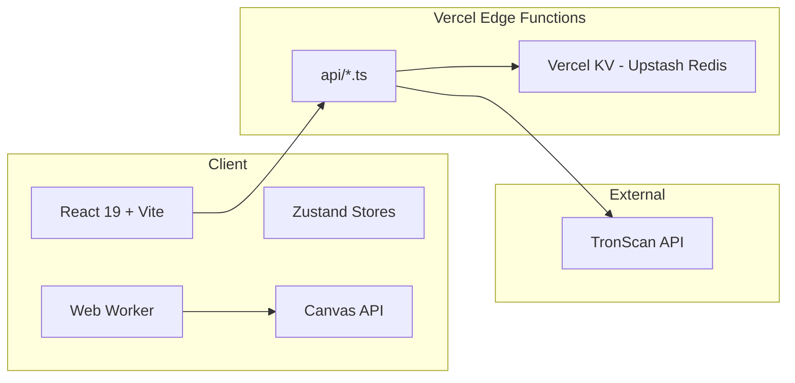

# Image Pipeline

Browser-based batch image processor. Client-side processing via Canvas API, thin edge backend for freemium enforcement.



---

## Live Deployment

| | |
|---|---|
| **URL** | `https://image-pipeline-six.vercel.app` |
| **KV** | Upstash Redis (Vercel KV, Free tier, `iad1`) |
| **Status** | ✅ All 9 API endpoints operational |

---

## Environment Variables (Production)

| Variable | Set | Source |
|----------|-----|--------|
| `KV_REST_API_URL` | ✅ | Upstash KV integration |
| `KV_REST_API_TOKEN` | ✅ | Upstash KV integration |
| `APP_URL` | ✅ | `https://image-pipeline-six.vercel.app` |
| `USDT_ADDRESS` | ✅ | `TPenBbjw2BE1zBMot2kKrNuGgYdbPvQwDr` |
| `USDT_CONTRACT` | ✅ | `TR7NHqjeKQxGTCi8q8ZY4pL8otSzgjLj6t` |
| `CRON_SECRET` | ✅ | Auto-generated |

---

## Recent Fixes & Changes

### Code Review (7 critical + 9 warning)
- **Edge functions** (14 files): health, event, check-limit, crypto/verify, crypto/config, pipeline/share, pipeline/[shareId], error, cleanup + shared helpers
- **Stripe → Crypto**: replaced Stripe SDK with USDT TRC-20 via TronScan API (no npm deps, no webhooks)
- **Cycle detection**: `PipelineEngine` throws on cyclic graphs with node names in error
- **Compress/Format fix**: nodes now apply real canvas operations (were no-ops)
- **Zero-dimension crop**: `applyCrop` throws `"empty crop region"`
- **Subscribe leak**: `EditorLayout` returns `unsub` in `useEffect` cleanup
- **Interval leak**: `useVerifyTrc20` has cleanup + double-start guard
- **Path traversal**: `sanitizeFilename` uses `while` loop for recursive `..` removal
- **Blob URL lifecycle**: `ProcessingModal` uses `file.file` directly (no fetch)
- **Blob URL cleanup**: `removeFile`/`clearFiles` call `URL.revokeObjectURL`
- **strict mode**: `tsconfig.app.json` — `"strict": true`
- **HSTS**: added `Strict-Transport-Security` header
- **Accessible UI**: NodePalette/FileList `aria-label`, `role="listbox"`, proper heading hierarchy
- **RightSidebar**: removed dead component
- **jsdom**: removed from `package.json` (not used)

### Build Fixes
- **`.js` extensions**: added to all relative imports in `api/` — Vercel edge requires explicit extensions
- **`process.env` declare**: TypeScript 6.0.3 on Vercel doesn't have Node types — added `declare` in each API file
- **`functions.runtime` removed**: `vercel.json` `"runtime": "edge"` caused build failures — Vercel auto-detects edge functions

---

## Tech Stack

| Layer | Technology |
|-------|-----------|
| Framework | React 19, TypeScript 6.0, Vite 8 |
| Styling | Tailwind CSS v4, @tailwindcss/vite |
| State | Zustand 5 + persist middleware |
| Flow UI | @xyflow/react 12 |
| Icons | lucide-react |
| Animation | framer-motion |
| ZIP | JSZip (in Web Worker via `?worker`) |
| Backend | Vercel Edge Functions (Deno) |
| KV | Upstash Redis (via Vercel KV) |
| Payments | USDT TRC-20 (self-hosted verification) |

---

## Project Structure

```
image-pipeline/
├── api/                          # Vercel Edge Functions
│   ├── _shared/                  # Shared edge utilities
│   │   ├── ip.ts                 # Client IP extraction (CF / Vercel / X-Real-IP)
│   │   ├── kv.ts                 # Redis REST API wrapper (get/set/del/incr/zadd/zcard/...)
│   │   ├── response.ts           # jsonResponse, errorResponse, corsResponse
│   │   └── types.ts              # ApiResponse<T>, SessionData, LimitType
│   ├── health.ts                 # GET /api/health — KV connectivity check
│   ├── event.ts                  # POST /api/event — anonymous analytics (rate: 100/min)
│   ├── check-limit.ts            # GET /api/check-limit — freemium sliding-window
│   ├── crypto/
│   │   ├── config.ts             # GET /api/crypto/config — USDT address + prices
│   │   └── verify.ts             # POST /api/crypto/verify — TxID verification via TronScan
│   ├── pipeline/
│   │   ├── share.ts              # POST /api/pipeline/share — share 8-char ID
│   │   └── [shareId].ts          # GET /api/pipeline/:id — load shared pipeline
│   ├── error.ts                  # POST /api/error — client error reporting
│   └── cleanup.ts                # Cron 3AM daily (cron secret gated)
│
├── src/
│   ├── components/
│   │   ├── layout/
│   │   │   ├── EditorLayout.tsx   # Editor shell (ReactFlow provider, sidebar, header)
│   │   │   ├── Header.tsx         # Process/Save/Undo/Redo buttons + plan badge
│   │   │   └── Sidebar.tsx        # Left sidebar (Nodes/Files/Saved tabs) + UsageIndicator
│   │   ├── pipeline/
│   │   │   ├── FlowEditor.tsx     # ReactFlow canvas with drag-drop node creation
│   │   │   ├── BaseNode.tsx       # Custom node template (memo-wrapped)
│   │   │   ├── NodePalette.tsx    # Draggable node type list
│   │   │   └── NodeSettings.tsx   # Per-node-type settings panels (589→split recommended)
│   │   ├── files/
│   │   │   ├── FileUploader.tsx   # Drag-drop + click upload (10MB free / 500MB pro)
│   │   │   └── FileList.tsx       # File list with status indicators
│   │   ├── processing/
│   │   │   └── ProcessingModal.tsx # Process loop + limit check + ZIP download
│   │   ├── pricing/
│   │   │   ├── PricingPage.tsx     # Pricing cards (Free / $10 Pro / $30 Lifetime)
│   │   │   └── CryptoModal.tsx     # USDT TRC-20 payment with TxID verification
│   │   ├── landing/
│   │   │   └── LandingPage.tsx     # Marketing landing page
│   │   └── onboarding/
│   │       └── OnboardingTour.tsx  # 7-step interactive tour
│   │
│   ├── core/                      # Image processing engine
│   │   ├── PipelineEngine.ts      # Topological sort + node execution chain
│   │   ├── ZipAssembler.ts        # Multi-threaded ZIP via Web Worker
│   │   ├── zip-worker.ts          # JSZip worker (Vite `?worker` import)
│   │   └── canvas/
│   │       ├── resize.ts          # Lanczos / bilinear resize
│   │       ├── crop.ts            # px / percent crop with zero-dim guard
│   │       ├── compress.ts        # JPEG compression via toBlob
│   │       ├── format.ts          # PNG/JPEG/WebP/AVIF conversion with support check
│   │       ├── watermark.ts       # Text overlay with XSS sanitization
│   │       ├── enhance.ts         # Lanczos upscaling (main-thread, O(N*kernel²))
│   │       └── denoise.ts         # Bilateral filter denoising
│   │
│   ├── hooks/
│   │   └── useVerifyTrc20.ts      # Polling hook for crypto TxID verification
│   │
│   ├── lib/
│   │   ├── edge-client.ts         # API client with retry + offline fallback
│   │   ├── sanitize.ts            # XSS + prototype pollution sanitizers
│   │   └── utils.ts               # cn() utility (clsx + tailwind-merge)
│   │
│   ├── stores/
│   │   ├── pipeline.store.ts      # Nodes, edges, undo/redo (persisted, sanitized)
│   │   ├── files.store.ts         # File list + blob URL lifecycle management
│   │   ├── user.store.ts          # Plan, sessionId, usage, server sync
│   │   ├── ui.store.ts            # Sidebar state, processing progress, onboarding
│   │   └── saved-pipelines.store.ts # Saved pipelines CRUD (persisted)
│   │
│   ├── test/
│   │   ├── security.test.ts       # 30 tests: PP, XSS, crypto, storage, engine
│   │   └── xss-security.test.ts   # 16 tests: rename, watermark, CSP, rate limits
│   │
│   └── types/
│       ├── index.ts               # Barrel export
│       └── pipeline.types.ts      # NodeType, PipelineNode, PlanTier, limits config
│
├── vercel.json                    # SPA rewrites + API routing + CSP + HSTS
├── vite.config.ts                 # Vite + React + Tailwind + manualChunks
├── vitest.config.ts               # Test runner configuration
├── tsconfig*.json                 # TypeScript configs (app / node / api)
└── package.json
```

---

## API Endpoints

| Method | Path | Rate Limit | Purpose |
|--------|------|-----------|---------|
| `GET` | `/api/health` | — | KV connectivity + latency check |
| `POST` | `/api/event` | 100/min/IP | Anonymous analytics (no PII) |
| `GET` | `/api/check-limit` | 60/min/IP | Freemium sliding-window limit check |
| `GET` | `/api/crypto/config` | — | USDT address + prices (cached 5min) |
| `POST` | `/api/crypto/verify` | 5/min/IP | TRC-20 TxID verification via TronScan |
| `POST` | `/api/pipeline/share` | 10/min/IP | Save pipeline → 8-char share ID |
| `GET` | `/api/pipeline/:id` | 60/min/IP | Load shared pipeline (CDN-cached 1h) |
| `POST` | `/api/error` | — | Client error reporting |
| `GET` | `/api/cleanup` | cron auth | Daily maintenance (3AM) |

All endpoints return `ApiResponse<T>`:

```typescript
{
  success: boolean;
  data?: T;
  error?: { code: string; message: string; details?: Record<string, unknown> };
  meta: { requestId: string; timestamp: string };
}
```

---

## Data Flow

### Image Processing
```
Upload → FileList (Zustand) → PipelineEngine.execute()
  ├── findActiveChain() — BFS from Load node
  ├── topologicalSortNodes() — Kahn's algorithm with cycle detection
  ├── processNode() — per-node: resize → crop → watermark → denoise → compress → format
  └── convertFormat() — final export (PNG/JPEG/WebP/AVIF)
↓
ZipAssembler (Web Worker) → Download ZIP
```

### Freemium Enforcement
```
Process Button → checkServerLimit("files") → GET /api/check-limit
  ├── Pro/Lifetime → allowed: true (unlimited)
  └── Free → sliding window (ZSET) → 10 files/hour
       ├── within limit → process
       └── exceeded → upgrade modal → /pricing
```

### Crypto Payment
```
Buy with Crypto → CryptoModal → GET /api/crypto/config
  ├── Show address + QR + TxID input
  └── User enters TxID → POST /api/crypto/verify
       ├── Rate 5/min/IP · 10/session
       ├── TxID dedup (90d via setnx)
       ├── TronScan API verification
       └── On success → KV session updated → syncPlanFromServer
```

---

## Rate Limiting

| Algorithm | Where | Implementation |
|-----------|-------|---------------|
| Fixed window | `/api/event` | `INCR` + `EXPIRE 60` |
| Fixed window | `/api/check-limit` (meta) | `INCR` + `EXPIRE 60` |
| Sliding window | `/api/check-limit` (limits) | `ZREMRANGEBYSCORE` + `ZCARD` + `ZADD` |
| Fixed window | `/api/crypto/verify` | `INCR` + `EXPIRE 60` |
| Fixed window | `/api/pipeline/share` | `INCR` + `EXPIRE 60` |
| Per-session | `/api/crypto/verify` | `INCR session:attempts` (max 10/day) |

**Client fallback:** If edge functions are unreachable, `edge-client.ts` enforces limits via localStorage counters (trivially bypassable — server is authoritative).

---

## Security

### Defense Layers

| Threat | Protection |
|--------|-----------|
| XSS (watermark) | `sanitizeWatermarkText()` strips `<>` before `fillText` |
| XSS (rename) | `NodeSettings.tsx:269` strips `<>` from rename pattern |
| XSS (CSP) | `Content-Security-Policy` in `vercel.json` |
| Prototype pollution | `sanitizeData()` filters `__proto__`/`constructor`/`prototype` |
| Path traversal | `sanitizeFilename()` loop removes `..` variants |
| Blob URL leaks | `removeFile()`/`clearFiles()` call `URL.revokeObjectURL` |
| Session forgery | Server-enforced tier (KV), not client |
| TxID replay | 90-day dedup via `SETNX` |
| Rate limit bypass | Server-enforced, client fallback is convenience only |
| Webhook forgery | HMAC-SHA256 verification via `crypto.subtle.verify` |

### HTTP Security Headers

```json
{
  "Content-Security-Policy": "default-src 'self'; script-src 'self' 'wasm-unsafe-eval'; style-src 'self' 'unsafe-inline'; img-src 'self' blob: data:; font-src 'self' data:; connect-src 'self'; worker-src 'self' blob:; frame-src 'none'; object-src 'none'",
  "Strict-Transport-Security": "max-age=63072000; includeSubDomains; preload",
  "X-Content-Type-Options": "nosniff",
  "X-Frame-Options": "DENY",
  "Referrer-Policy": "strict-origin-when-cross-origin"
}
```

---

## KV Data Model

| Key Pattern | Type | TTL | Purpose |
|-------------|------|-----|---------|
| `session:{uuid}` | JSON | 30d | User session data (tier, lastActive) |
| `stripe:{uuid}` | JSON | — | Stripe subscription (legacy, not used) |
| `crypto:activation:{uuid}` | JSON | 30d | Crypto payment record |
| `crypto:tx:{txId}` | String | 90d | TxID dedup |
| `crypto:attempts:{uuid}` | Int | 1d | Per-session verify attempts |
| `rate_limit:{ip}:*` | Sorted Set / Int | 1h | Rate limit windows |
| `event:{date}:{hour}:{uuid}:{rnd}` | JSON | 7d | Analytics events |
| `pipeline:{shareId}` | JSON | 7-30d | Shared pipeline config |
| `webhook:{eventId}` | String | 1d | Idempotency |
| `health:ping` | String | 60s | Health check heartbeat |

---

## Changelog

| Commit | Description |
|--------|-------------|
| `003cf1b` | declare `process` in API files to suppress TS errors |
| `020593c` | remove leaked `_kv_sec.txt`, add to `.gitignore` |
| `aeba2fd` | add `.js` extensions to API imports for Vercel edge |
| `62df1cc` | backend edge functions + crypto payments + code review fixes |
| (prior) | Initial setup with SPA, pipeline engine, Zustand stores, tests |

---

## Testing

46 tests across 2 files:

```
src/test/security.test.ts       — 30 tests (PP, format safety, engine, ZIP, stores, crypto)
src/test/xss-security.test.ts   — 16 tests (rename, watermark, file upload, CSP, rate limits)
```

Run: `npm run test`

---

## Deployment

### Prerequisites

1. Vercel project (Hobby plan or above)
2. Vercel KV (Upstash Redis) — add via Dashboard → Storage → Upstash for Redis
3. Env vars — set via Dashboard or CLI:

```bash
vercel env add KV_REST_API_URL production --value "<url>"
vercel env add KV_REST_API_TOKEN production --value "<token>"
vercel env add APP_URL production --value "https://image-pipeline-six.vercel.app"
vercel env add USDT_ADDRESS production --value "<trc20-wallet>"
vercel env add USDT_CONTRACT production --value "TR7NHqjeKQxGTCi8q8ZY4pL8otSzgjLj6t"
vercel env add CRON_SECRET production --value "<secret>"
```

### Deploy

```bash
vercel --prod
```

### Build Notes

- **No `stripe` or `zod`** — edge functions use raw `fetch` + REST API to keep under 1MB bundle limit
- **No `functions.runtime`** in `vercel.json` — Vercel auto-detects edge functions from the `api/` directory
- **`.js` extensions required** for all relative imports in edge function files
- **`process.env`** needs explicit `declare var process` in each file (Vercel build TS doesn't include Node types)

---

## Pricing

| Tier | Price | Limits |
|------|-------|--------|
| Free | $0 | 10 files/batch, 4 nodes, 10 batches/session, 2 formats, 10MB/file |
| Pro | $10 USDT (one-time) | Unlimited |
| Lifetime | $30 USDT (one-time) | Unlimited + future features |

Payment via USDT TRC-20. Verification via TronScan API through edge backend.

---

## Node Types

| Node | Settings | Canvas Op |
|------|----------|-----------|
| Load | fileId | Pass-through |
| Resize | width, height, mode (fit/fill/stretch), algorithm (auto/lanczos/bilinear) | `applyResize` |
| Crop | x, y, width, height, unit (px/percent) | `applyCrop` with zero-dim guard |
| Compress | quality (1-100), method (lossy/lossless) | JPEG compression via canvas |
| Format | targetFormat (PNG/JPEG/WebP/AVIF), quality | `convertFormat` |
| Watermark | text (sanitized), position, opacity, fontSize | `applyWatermark` |
| Rename | pattern `{original}_{index}`, extension | Pass-through (metadata) |
| Denoise | method (median/bilateral), strength, radius | `applyDenoise` |
| Export | format, quality, preserveMetadata | Final output conversion |
